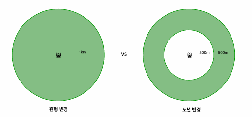
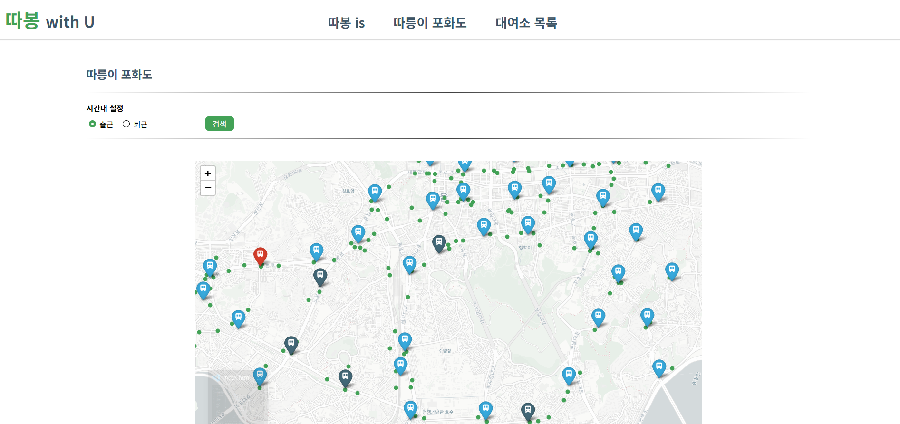

# ddabom (따릉이의 봄, 따봄)
- 따릉이 수요 분석 프로젝트

## Period
- 2025.03.25 ~ 2025.04.01 (약 1주)

## Motivation
- 기후동행카드 도입으로 대중교통과 따릉이의 연계를 위한 제도 마련
- 평일 출퇴근 시간대, 따릉이의 높은 이용량 및 쏠림 현상 문제
  
## Goal
- 따릉이 수요가 높은 평일 출퇴근 시간의 이용 편의 증진
  - 지하철역별 따릉이 수요 공급 불균형 여부를 분류하여, 쏠림 현상 문제의 개선을 위한 정보 제공

## Method
(1) 평일 출퇴근 시간의 따릉이 이용 행태 파악
  - Data Collection
    - 출처: 서울 열린데이터 광장
    - 방법: 데이터 파일 다운로드
    - 대상: 따릉이 대여소 정보, 지하철역사 정보

  - Data Preprocessing
    - 따릉이 이용 건에 대한 중복 데이터 처리
    - 동일 대여소 및 역사명에 대한 상이한 표기 통합
    - 출퇴근 시간대 데이터 추출 및 구분
   
  - Data Analysis
    - 따릉이 이용건수와 지하철 승, 하차 인원의 상관관계 파악
    - 따릉이 평균 이용시간과 직장인 평균 통근시간 비교
    - 지하철역과 그 주변 따릉이 대여소 간의 거리에 따른 따릉이 이용자 수 분포 확인
      - 주변 따릉이 대여소: 해당 지하철역으로부터 반경 350m 내에 위치
        - 거리 구간별 대여소 중복 비율읕 통해 정의

(2) 지하철역별 수요 공급 불균형 여부 분류
  - Data Collection
    - 출처: 통계지리정보서비스
    - 방법: 데이터 파일 다운로드
    - 대상: 격자 단위당 종사자 수, 거주 인구 수
   
  - Data Preprocessing
    - GeoPandas 를 활용하여 잠재 수요 인원 집계
      - 출근 시간은 역 주변 종사자 수, 퇴근 시간은 역 주변 거주 인구 수 집계
        - 역 주변: 반경 1km 이내
            - 따릉이 평균 이동 거리와 역 간 중복 집계를 고려하여 정의
              
        - 단순 반경 및 도넛형 반경 내 인원 집계
          - 역 인접 지역은 도보 이동 가능성이 높음
          - 도넛형 반경을 설정해 해당 구간의 인원은 따릉이 수요 인원 집계에서 제외
          
        &nbsp;
              
  - Data Analysis
    - 따릉이 적정 거치대 수 공식 도출
      - 지하철 이용 비율, 경제 활동 비율, 따릉이 잠재 수요 고객 수 활용
     
    - 역별 수요 공급 분균형 여부 분류
      - 공급 과잉, 적정, 부족으로 구분
           
    - 단순 반경과 도넛형 반경의 역별 수요 공급 불균형 여부 비교

## Results
(1) 평일 출퇴근 시간의 따릉이 이용 행태 파악
  - 따릉이는 다른 대중교통 (지하철) 과 연계하여 단거리 이동 시 사용하는 보조적인 교통수단
    
(2) 지하철역별 수요 공급 불균형 여부 분류
  - 단순 반경보다 도넛형 반경에 따른 따릉이 잠재 수요 인원 집계 방식이 더 적합함을 확인
    - 지하철역이 밀집된 지역의 경우, 역에서 최종 목적지까지 도보 이동 가능성이 높음
    - 역 주변 유동인구가 많더라도 실제 따릉이 수요와 반드시 비례하지 않음
      - 예: 을지로입구역은 주변 종사자 수가 많음에도 불구하고, 분석 결과 적정 거치대 수는 낮게 나타남

  - 역별 수요 공급 불균형 여부 분류에 성공했으나, 적정 거치대 수 산정 공식의 단순로 인해 정확도는 낮았음
    - 다만, 해당 공식 개선을 위한 핵심 피처 도출
    - 웹사이트에 역별 수요 공급 불균형 여부 분류 시각화
      
    &nbsp;&nbsp;&nbsp;&nbsp;
      
- [발표 자료](./0401_따릉이의봄.pdf)

## Review
  - 개선 및 발전방향
    - 각 지하철역 따릉이 수요 공급 불균형 지표의 세밀화
      - 따릉이 잠재 이용 비율 산정 시 따릉이 선호 비율 활용
        - 따릉이 대여건수와 유동인구 수을 활용한 정의
          
    - 각 지하철역 반경 내 정확한 잠재 수요 인원 추출 방법 고려
      - 100m 그리드 데이터를 활용한 현 방식에서는. 정확한 반경 내 인원 집계에 한계 존재
    
## Role
  - 프로젝트 기획 및 실행 전략 수립
  - 데이터 가공 및 분석
  - 발표
    
## Tech Stack
| 분야 | 기술/도구 |
|:-:|:-:|
| 프로그래밍 언어 |  |
| 데이터 가공 및 전처리 |     |
| 시각화 |   |
| 웹개발 | |
| 환경 |   |

 
